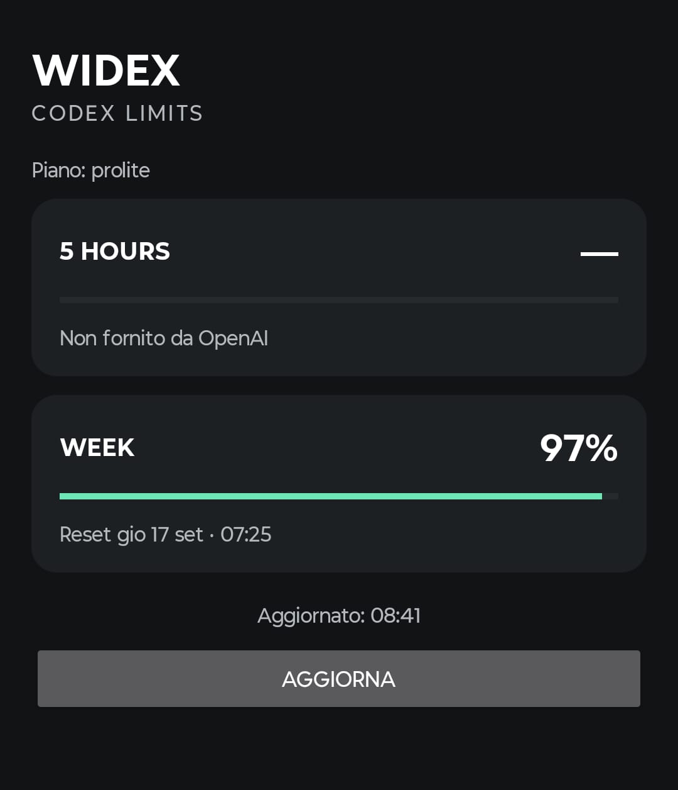
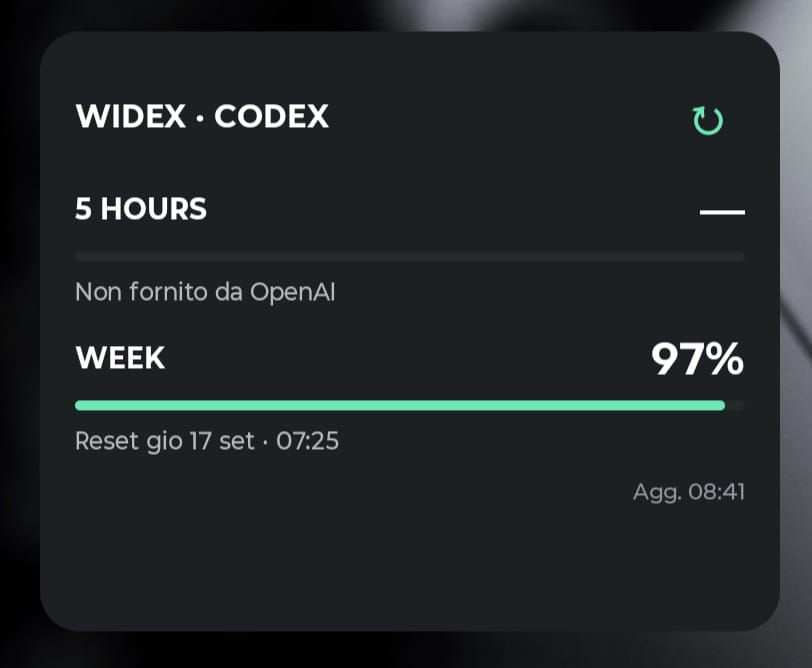

# Widex

Widex is a lightweight Android app and Home screen widget for monitoring remaining Codex usage limits without depending on a PC, local server, or external backend.

It connects directly to OpenAI using the Codex device-code login flow, keeps the authenticated session encrypted on the Android device, and displays the available 5-hour and weekly rate-limit windows when OpenAI provides them.

## Features

- **5 HOURS** and **WEEK** remaining quota with progress bars;
- readable reset date/time;
- live refresh from the app;
- live refresh from the Home screen widget using the `↻` button;
- background refresh approximately every 60 minutes using Android `JobScheduler`;
- one-time OpenAI device-code login, repeated only if the session is invalidated;
- access token, refresh token and account ID stored encrypted using **Android Keystore + AES/GCM**;
- no PC, home server, cloud relay or API-billing account required;
- no external runtime dependencies.

## Screenshots

| App | Home screen widget |
| --- | --- |
|  |  |

## Languages

Widex follows the Android device language automatically.

- **English** is the default language and fallback for unsupported locales.
- **Italian** is included as a native translation.

Date and time formatting also follows the device locale.

## Authentication

On first launch, Widex asks the user to connect an OpenAI account and opens the standard Codex device-code authorization flow in the browser.

The password and any two-factor authentication remain inside the OpenAI browser flow and are never handled by Widex.

After authorization, the credentials required to maintain the session are encrypted locally. On later launches, Widex opens directly to the limits dashboard and refreshes the access token in the background when necessary.

If OpenAI permanently invalidates the refresh token, Widex clears the unusable local credentials and asks the user to connect the account again.

## Home screen widget

The widget displays the same quota information as the app:

```text
WIDEX · CODEX                 ↻
5 HOURS                    78%
████████████████░░░░
Reset 01:34

WEEK                       43%
█████████░░░░░░░░░░░
Reset Mon 14 Sep · 18:42

                     Updated 23:48
```

Tap `↻` to request an immediate refresh. Tap the rest of the widget to open Widex.

The hourly background refresh is intentionally inexact: Android may defer jobs to save battery, especially while the device is in Doze mode. Manual refresh remains available at any time.

## Build from source

Current project configuration:

- Kotlin;
- minSdk 26;
- target/compile SDK 35;
- Java/Kotlin JVM target 17;
- Android Gradle Plugin 8.7.3;
- Kotlin plugin 2.0.21.

Open the repository in Android Studio and use:

`Build → Generate App Bundles or APKs → Build APK(s)`

The debug APK is generated at:

`app/build/outputs/apk/debug/app-debug.apk`

The Gradle wrapper is included in the repository, so command-line builds can also use:

```bash
./gradlew assembleDebug
```

## Security

- OpenAI username, password and 2FA are never entered into Widex;
- access token, refresh token and account ID are encrypted before persistent storage;
- the AES key is managed by Android Keystore and is not stored in the repository;
- quota percentages and reset timestamps are stored separately as non-sensitive local cache data;
- Widex does not require a personal server or relay service.

## Compatibility notice

Widex uses the Codex device-code authentication flow and the current ChatGPT/Codex usage endpoint (`/backend-api/wham/usage`). This endpoint is not a public, stability-guaranteed third-party API. OpenAI may change its authentication requirements, response schema or endpoint behavior in the future, which could require a Widex update.

Widex is an independent open-source project and is not affiliated with or endorsed by OpenAI.

## License

Copyright (C) 2026 Guido Sorarù

Widex is free software licensed under the **GNU General Public License version 3 only** (`GPL-3.0-only`). See [LICENSE](LICENSE) for the full license text.
